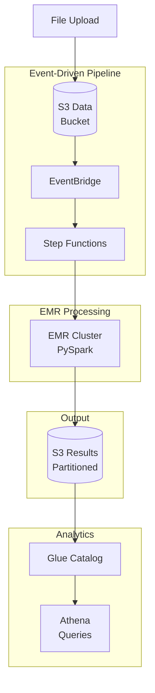
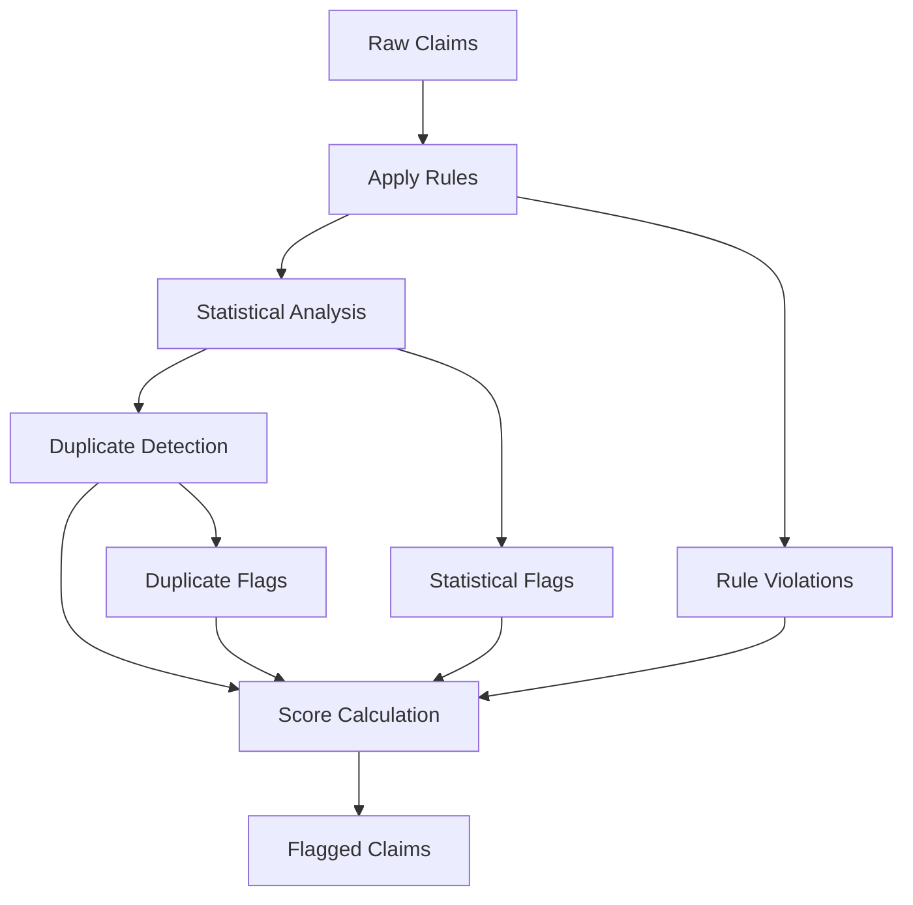

# Insurance Claims Fraud Detection

A PySpark-based fraud detection system for insurance claims, deployed on AWS using CDK.

[](https://caverac.github.io/insurance-fraud-detection/)

## Overview

This project demonstrates:
- **Event-driven pipeline** - Automatically triggers when claims data is uploaded to S3
- **Batch processing** of insurance claims using PySpark on EMR
- **Rule-based anomaly detection** for flagging unusual billing patterns
- **Statistical outlier detection** for identifying suspicious charges
- **Duplicate claim detection** using similarity matching
- **Partitioned results** for efficient querying with Athena

## Project Structure

```
insurance-fraud/
├── packages/
│   ├── fraud_detection/     # PySpark fraud detection application
│   │   ├── src/
│   │   │   └── fraud_detection/
│   │   │       ├── jobs/           # Spark jobs
│   │   │       ├── rules/          # Rule-based detection
│   │   │       ├── statistics/     # Statistical anomaly detection
│   │   │       └── utils/          # Shared utilities
│   │   └── tests/
│   ├── infra/               # AWS CDK infrastructure
│   │   ├── src/
│   │   │   └── infra/
│   │   │       └── stacks/
│   │   └── tests/
│   └── docs/                # Documentation site
│       └── docs/
├── pyproject.toml           # Root project configuration (uv workspace)
├── package.json             # Node.js dependencies (CDK)
└── README.md
```

## Data Sources

This project is designed to work with CMS Medicare public datasets:
- [Medicare Provider Utilization and Payment Data](https://data.cms.gov/)
- Synthetic claims data for development/testing

## Getting Started

### Prerequisites

- [uv](https://docs.astral.sh/uv/) (Python package manager)
- Java 11+ (for PySpark)
- Node.js 22+ (for CDK)
- Yarn 4+ (for package management)
- AWS CLI configured with appropriate credentials

### Installation

```bash
# Install all dependencies (Python + Node.js + pre-commit hooks)
make install
```

Or manually:

```bash
# Install Python dependencies and create virtual environment
uv sync

# Install pre-commit hooks
uv run pre-commit install

# Install Node.js dependencies (CDK)
yarn install
```

### Local Development

```bash
# Run tests
make test
# Or: uv run pytest

# Run linting (pylint + flake8 + pydocstyle)
make lint

# Format code (black + isort)
make format

# Type checking
make type-check

# Generate sample data
make sample-data

# Run fraud detection locally
make run-local

# Analyze results
make analyze
```

### Deploy to AWS

```bash
# Bootstrap CDK (first time only)
make cdk-bootstrap

# Deploy all stacks
make cdk-deploy

# View changes before deploying
make cdk-diff
```

### Run the Pipeline

```bash
# Upload claims data to trigger the pipeline
DATA_BUCKET=$(aws ssm get-parameter \
    --name "/fraud-detection/data-bucket" \
    --query "Parameter.Value" --output text)

aws s3 cp claims.csv s3://$DATA_BUCKET/claims/

# Monitor execution
STATE_MACHINE_ARN=$(aws ssm get-parameter \
    --name "/fraud-detection/state-machine-arn" \
    --query "Parameter.Value" --output text)

aws stepfunctions list-executions \
    --state-machine-arn $STATE_MACHINE_ARN \
    --max-results 5
```

### Query Results

After the pipeline completes, query results in Athena:

```sql
-- Discover new partitions
MSCK REPAIR TABLE fraud_detection_db.flagged_claims;

-- Query high-risk claims
SELECT * FROM fraud_detection_db.flagged_claims
WHERE fraud_score > 0.7
ORDER BY fraud_score DESC;
```

### Destroy Infrastructure

```bash
# Run cleanup script first (handles circular dependencies)
./packages/infra/scripts/cleanup.sh

# Then destroy stacks
cd packages/infra && yarn cdk destroy --all
```

## Fraud Detection Features

### Rule-Based Detection
- Provider billing pattern analysis
- Procedure code validation
- Geographic anomaly detection
- Temporal pattern analysis

### Statistical Detection
- Charge amount outliers (IQR/Z-score methods)
- Frequency anomalies
- Benford's Law analysis for charge amounts

### Duplicate Detection
- Exact match detection
- Fuzzy matching for near-duplicates
- Claim clustering

## Architecture



### Pipeline Flow

1. **Upload** - Claims CSV uploaded to S3 `claims/` prefix
2. **Trigger** - EventBridge detects upload, triggers Step Functions
3. **Process** - EMR cluster spins up, runs PySpark fraud detection
4. **Store** - Results written to S3, partitioned by `detection_date`
5. **Query** - Athena queries via Glue Data Catalog

## Detection Pipeline



## Documentation

Full documentation is available at: **[https://caverac.github.io/insurance-fraud-detection/](https://caverac.github.io/insurance-fraud-detection/)**

Build and serve the documentation locally:

```bash
# Serve locally with live reload
make docs-serve

# Build static site
make docs
```

Documentation includes:
- [AWS Infrastructure](https://caverac.github.io/insurance-fraud-detection/architecture/aws/) - CDK stacks, deployment, and cleanup
- [Data Flow](https://caverac.github.io/insurance-fraud-detection/architecture/data-flow/) - Pipeline architecture
- [Running Jobs](https://caverac.github.io/insurance-fraud-detection/guide/jobs/) - Local and AWS execution
- [API Reference](https://caverac.github.io/insurance-fraud-detection/api/detector/) - Module documentation

## License

MIT
