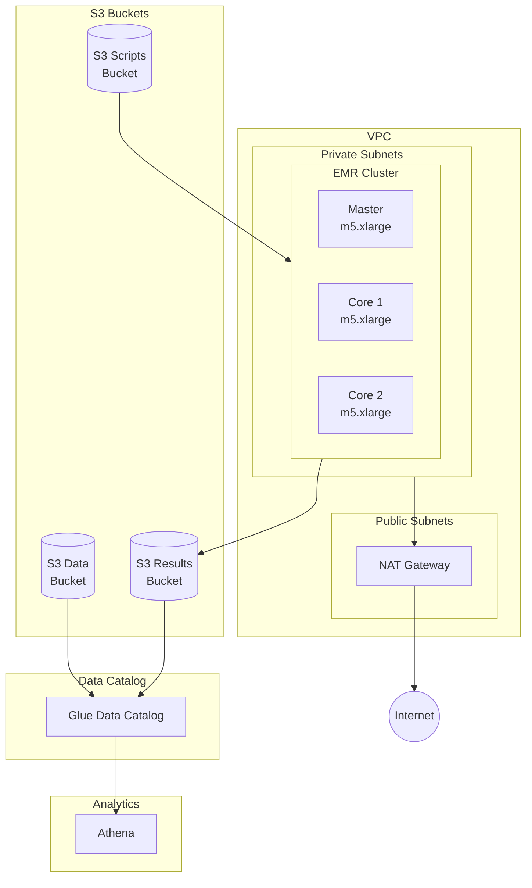
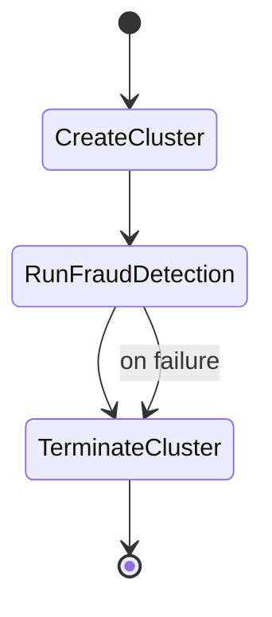

# AWS Infrastructure

## Overview

The fraud detection system is deployed on AWS using CDK infrastructure as code.

## Architecture Diagram



## CDK Stacks

### Data Lake Stack

**Resources**:

- S3 bucket for raw claims data
- S3 bucket for processed results
- Glue database for metadata
- Glue crawlers for schema discovery

**Key Configuration**:

```python
# Data bucket with lifecycle rules
self.data_bucket = s3.Bucket(
    encryption=s3.BucketEncryption.S3_MANAGED,
    versioned=True,
    lifecycle_rules=[
        s3.LifecycleRule(
            transitions=[
                s3.Transition(
                    storage_class=s3.StorageClass.INFREQUENT_ACCESS,
                    transition_after=cdk.Duration.days(90),
                )
            ],
        ),
    ],
)
```

### Processing Stack

**Resources**:

- VPC with public/private subnets
- EMR security groups
- IAM roles for EMR
- Step Functions state machine
- Scripts bucket for Spark jobs

**EMR Configuration**:

```python
instances=tasks.EmrCreateCluster.InstancesConfigProperty(
    instance_fleets=[
        tasks.EmrCreateCluster.InstanceFleetConfigProperty(
            instance_fleet_type=tasks.EmrCreateCluster.InstanceRoleType.MASTER,
            target_on_demand_capacity=1,
            instance_type_configs=[
                tasks.EmrCreateCluster.InstanceTypeConfigProperty(
                    instance_type="m5.xlarge",
                )
            ],
        ),
        tasks.EmrCreateCluster.InstanceFleetConfigProperty(
            instance_fleet_type=tasks.EmrCreateCluster.InstanceRoleType.CORE,
            target_on_demand_capacity=2,
            instance_type_configs=[
                tasks.EmrCreateCluster.InstanceTypeConfigProperty(
                    instance_type="m5.xlarge",
                )
            ],
        ),
    ],
),
```

### Analytics Stack

**Resources**:

- Athena workgroup
- Glue tables for claims and results
- Named queries for common analysis
- Query results bucket

## Step Functions Pipeline



## Deployment

### Prerequisites

1. AWS CLI configured
2. CDK CLI installed
3. Bootstrap CDK (first time)

```bash
cdk bootstrap aws://ACCOUNT_ID/REGION
```

### Deploy All Stacks

```bash
make cdk-deploy
# Or: yarn cdk:deploy
```

### Deploy Individual Stacks

```bash
yarn cdk deploy fraud-detection-data-lake
yarn cdk deploy fraud-detection-processing
yarn cdk deploy fraud-detection-analytics
```

### Destroy Stacks

```bash
make cdk-destroy
# Or: yarn cdk:destroy
```

## Cost Optimization

### EMR Spot Instances

Use Spot instances for cost savings:

```python
instance_fleets=[
    tasks.EmrCreateCluster.InstanceFleetConfigProperty(
        instance_fleet_type=tasks.EmrCreateCluster.InstanceRoleType.CORE,
        target_spot_capacity=2,
        target_on_demand_capacity=0,  # All Spot
        instance_type_configs=[
            tasks.EmrCreateCluster.InstanceTypeConfigProperty(
                instance_type="m5.xlarge",
                bid_price_as_percentage_of_on_demand_price=50,
            ),
            # Fallback instance types
            tasks.EmrCreateCluster.InstanceTypeConfigProperty(
                instance_type="m5a.xlarge",
                bid_price_as_percentage_of_on_demand_price=50,
            ),
        ],
    ),
]
```

### S3 Storage Classes

Automatic tiering configured:

- Hot data: S3 Standard
- After 90 days: S3 Infrequent Access
- Old versions: Expire after 30 days

### EMR Managed Scaling

```python
managed_scaling_policy=tasks.EmrCreateCluster.ManagedScalingPolicyProperty(
    compute_limits=tasks.EmrCreateCluster.ComputeLimitsProperty(
        unit_type=tasks.EmrCreateCluster.ComputeLimitsUnitType.INSTANCES,
        minimum_capacity_units=2,
        maximum_capacity_units=10,
    ),
)
```

## Security

### Encryption

- S3: Server-side encryption (SSE-S3)
- EMR: In-transit encryption enabled
- Athena: Query results encrypted

### Network Security

- EMR in private subnets
- Security groups restrict traffic
- No public IPs on EMR instances

### IAM Roles

- EMR service role: Managed policy
- EMR EC2 role: Limited S3 access
- Glue crawler role: Read-only S3

## Monitoring

### CloudWatch Dashboards

Key metrics:

- EMR cluster state
- S3 bucket sizes
- Athena query performance
- Step Functions executions

### Alarms

```python
cloudwatch.Alarm(
    metric=state_machine.metric_failed(),
    threshold=1,
    evaluation_periods=1,
    alarm_actions=[sns_topic],
)
```

### Cost Alerts

```python
budgets.CfnBudget(
    budget=budgets.CfnBudget.BudgetDataProperty(
        budget_type="COST",
        time_unit="MONTHLY",
        budget_limit=budgets.CfnBudget.SpendProperty(
            amount=500,
            unit="USD",
        ),
    ),
)
```

## Outputs

After deployment, the following outputs are available:

| Output | Description |
|--------|-------------|
| DataBucketName | Raw data bucket |
| ResultsBucketName | Results bucket |
| ScriptsBucketName | Spark scripts bucket |
| GlueDatabaseName | Glue catalog database |
| AthenaWorkgroupName | Athena workgroup |
| StateMachineArn | Step Functions ARN |
