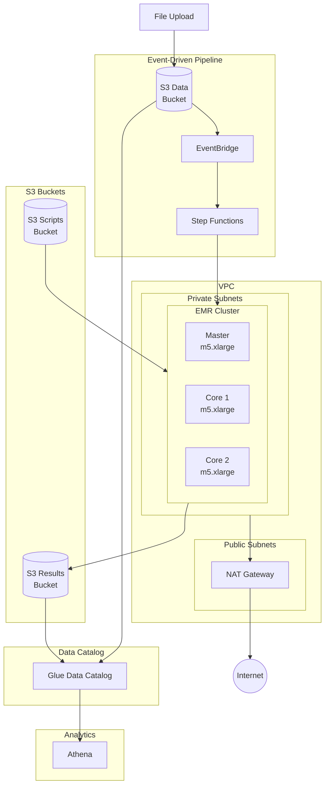
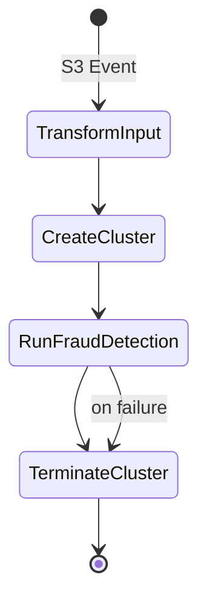

# AWS Infrastructure

## Overview

The fraud detection system is deployed on AWS using CDK infrastructure as code.

## Architecture Diagram



## CDK Stacks

### Data Lake Stack

**Resources**:

- S3 bucket for raw claims data (EventBridge notifications enabled)
- S3 bucket for processed results
- Glue database for metadata
- Glue crawlers for schema discovery

**Key Configuration**:

```python
# Data bucket with lifecycle rules
self.data_bucket = s3.Bucket(
    encryption=s3.BucketEncryption.S3_MANAGED,
    versioned=True,
    lifecycle_rules=[
        s3.LifecycleRule(
            transitions=[
                s3.Transition(
                    storage_class=s3.StorageClass.INFREQUENT_ACCESS,
                    transition_after=cdk.Duration.days(90),
                )
            ],
        ),
    ],
)
```

### Processing Stack

**Resources**:

- VPC with public/private subnets
- EMR security groups
- IAM roles for EMR
- Step Functions state machine
- EventBridge rule (S3 trigger)
- Scripts bucket for Spark jobs

**EMR Configuration**:

```python
instances=tasks.EmrCreateCluster.InstancesConfigProperty(
    instance_fleets=[
        tasks.EmrCreateCluster.InstanceFleetConfigProperty(
            instance_fleet_type=tasks.EmrCreateCluster.InstanceRoleType.MASTER,
            target_on_demand_capacity=1,
            instance_type_configs=[
                tasks.EmrCreateCluster.InstanceTypeConfigProperty(
                    instance_type="m5.xlarge",
                )
            ],
        ),
        tasks.EmrCreateCluster.InstanceFleetConfigProperty(
            instance_fleet_type=tasks.EmrCreateCluster.InstanceRoleType.CORE,
            target_on_demand_capacity=2,
            instance_type_configs=[
                tasks.EmrCreateCluster.InstanceTypeConfigProperty(
                    instance_type="m5.xlarge",
                )
            ],
        ),
    ],
),
```

### Analytics Stack

**Resources**:

- Athena workgroup
- Glue tables for claims and results
- Named queries for common analysis
- Query results bucket

## Step Functions Pipeline

The pipeline is triggered automatically when files are uploaded to the `claims/` prefix in the data bucket.



**Pipeline States**:

1. **TransformInput** - Extracts S3 bucket and key from EventBridge event
2. **CreateCluster** - Spins up EMR cluster with Python 3.13 bootstrap
3. **RunFraudDetection** - Submits Spark job with dynamic input path
4. **TerminateCluster** - Cleans up EMR resources

**EventBridge Rule**:

```python
events.Rule(
    event_pattern=events.EventPattern(
        source=["aws.s3"],
        detail_type=["Object Created"],
        detail={
            "bucket": {"name": events.Match.exact_string(data_bucket.bucket_name)},
            "object": {"key": events.Match.prefix("claims/")},
        },
    ),
)
```

## Deployment

### Prerequisites

1. AWS CLI configured
2. CDK CLI installed
3. Bootstrap CDK (first time)

```bash
cdk bootstrap aws://ACCOUNT_ID/REGION
```

### Deploy All Stacks

```bash
# From project root
make cdk-deploy

# Or from packages/infra
cd packages/infra && yarn deploy
```

### Deploy Individual Stacks

```bash
# From packages/infra
cd packages/infra
yarn cdk deploy fraud-detection-data-lake
yarn cdk deploy fraud-detection-processing
yarn cdk deploy fraud-detection-analytics
```

### Destroy Stacks

```bash
# From project root
make cdk-destroy

# Or from packages/infra
cd packages/infra && yarn destroy
```

#### Troubleshooting Stack Deletion

Stack deletion may fail due to:

1. **Athena workgroup not empty** - Contains saved queries or query history
2. **EMR security groups with circular dependencies** - Security groups reference each other
3. **Running EMR clusters or Step Functions executions**

If `yarn destroy` fails, run the cleanup script first:

```bash
# Run cleanup script to remove problematic resources
./packages/infra/scripts/cleanup.sh

# Then retry destroy
cd packages/infra && yarn cdk destroy --all
```

The cleanup script will:

- Delete the Athena workgroup with `--recursive-delete-option`
- Revoke circular security group rules and delete EMR security groups
- Terminate any running EMR clusters
- Stop any running Step Functions executions

#### Manual Cleanup (if script fails)

If the cleanup script doesn't resolve the issue:

```bash
# 1. Delete Athena workgroup
aws athena delete-work-group \
    --work-group fraud-detection-workgroup \
    --recursive-delete-option

# 2. Find and delete EMR security groups
# First, list them
aws ec2 describe-security-groups \
    --filters "Name=group-name,Values=*fraud-detection*EMR*" \
    --query "SecurityGroups[].{ID:GroupId,Name:GroupName}"

# Revoke all ingress rules (replace SG_ID with actual IDs)
aws ec2 revoke-security-group-ingress \
    --group-id SG_ID \
    --protocol all \
    --source-group OTHER_SG_ID

# Delete security groups
aws ec2 delete-security-group --group-id SG_ID

# 3. Delete failed CloudFormation stacks from console
# Go to CloudFormation → Select stack → Delete → Retain failing resources
```

## Cost Optimization

### EMR Spot Instances

Use Spot instances for cost savings:

```python
instance_fleets=[
    tasks.EmrCreateCluster.InstanceFleetConfigProperty(
        instance_fleet_type=tasks.EmrCreateCluster.InstanceRoleType.CORE,
        target_spot_capacity=2,
        target_on_demand_capacity=0,  # All Spot
        instance_type_configs=[
            tasks.EmrCreateCluster.InstanceTypeConfigProperty(
                instance_type="m5.xlarge",
                bid_price_as_percentage_of_on_demand_price=50,
            ),
            # Fallback instance types
            tasks.EmrCreateCluster.InstanceTypeConfigProperty(
                instance_type="m5a.xlarge",
                bid_price_as_percentage_of_on_demand_price=50,
            ),
        ],
    ),
]
```

### S3 Storage Classes

Automatic tiering configured:

- Hot data: S3 Standard
- After 90 days: S3 Infrequent Access
- Old versions: Expire after 30 days

### EMR Managed Scaling

```python
managed_scaling_policy=tasks.EmrCreateCluster.ManagedScalingPolicyProperty(
    compute_limits=tasks.EmrCreateCluster.ComputeLimitsProperty(
        unit_type=tasks.EmrCreateCluster.ComputeLimitsUnitType.INSTANCES,
        minimum_capacity_units=2,
        maximum_capacity_units=10,
    ),
)
```

## Security

### Encryption

- S3: Server-side encryption (SSE-S3)
- EMR: In-transit encryption enabled
- Athena: Query results encrypted

### Network Security

- EMR in private subnets
- Security groups restrict traffic
- No public IPs on EMR instances

### IAM Roles

- EMR service role: Managed policy
- EMR EC2 role: Limited S3 access
- Glue crawler role: Read-only S3

## Monitoring

### CloudWatch Dashboards

Key metrics:

- EMR cluster state
- S3 bucket sizes
- Athena query performance
- Step Functions executions

### Alarms

```python
cloudwatch.Alarm(
    metric=state_machine.metric_failed(),
    threshold=1,
    evaluation_periods=1,
    alarm_actions=[sns_topic],
)
```

### Cost Alerts

```python
budgets.CfnBudget(
    budget=budgets.CfnBudget.BudgetDataProperty(
        budget_type="COST",
        time_unit="MONTHLY",
        budget_limit=budgets.CfnBudget.SpendProperty(
            amount=500,
            unit="USD",
        ),
    ),
)
```

## Outputs

After deployment, the following outputs are available:

| Output | Description |
|--------|-------------|
| DataBucketName | Raw data bucket |
| ResultsBucketName | Results bucket |
| ScriptsBucketName | Spark scripts bucket |
| GlueDatabaseName | Glue catalog database |
| AthenaWorkgroupName | Athena workgroup |
| StateMachineArn | Step Functions ARN |
