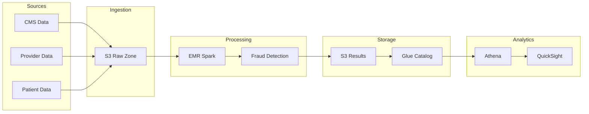
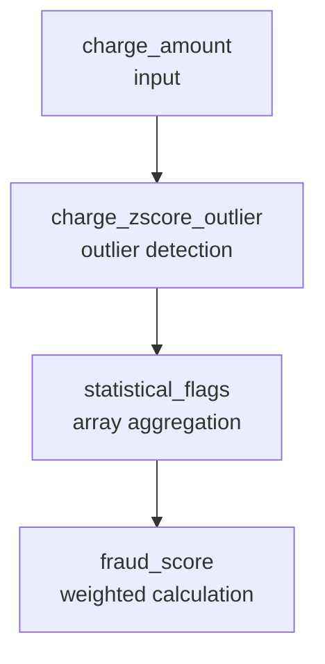

# Data Flow

## End-to-End Pipeline



## Data Zones

### Raw Zone (Bronze)

**Location**: `s3://{project}-data-{account}-{region}/`

**Purpose**: Store raw, unprocessed data as received

**Structure**:
```
claims/
├── year=2024/
│   ├── month=01/
│   │   ├── part-00000.parquet
│   │   └── part-00001.parquet
│   └── month=02/
│       └── ...
providers/
└── providers.parquet
patients/
└── patients.parquet
```

**Retention**: Indefinite (transition to IA after 90 days)

### Processed Zone (Silver)

**Location**: `s3://{project}-results-{account}-{region}/`

**Purpose**: Store fraud detection results

**Structure**:
```
flagged/
├── detection_date=2024-01-15/
│   ├── part-00000.parquet
│   └── part-00001.parquet
└── detection_date=2024-01-16/
    └── ...
aggregates/
├── provider_summary/
└── daily_stats/
```

## Processing Stages

### Stage 1: Data Validation

```python
# Validate schema
claims = spark.read.parquet(input_path)
validate_schema(claims, EXPECTED_SCHEMA)

# Check data quality
stats = claims.select(
    F.count("*").alias("total"),
    F.sum(F.col("claim_id").isNull().cast("int")).alias("null_ids"),
    F.sum(F.col("charge_amount") < 0).cast("int").alias("negative_charges"),
)
```

### Stage 2: Rule Application

```python
# Apply each rule sequentially
claims = billing_rules.check_daily_procedure_limits(claims)
claims = billing_rules.check_patient_claim_frequency(claims)
claims = billing_rules.check_weekend_billing(claims)
claims = billing_rules.check_round_amounts(claims)
claims = geographic_rules.check_provider_patient_distance(claims)
claims = geographic_rules.check_state_mismatch(claims)
```

### Stage 3: Statistical Analysis

```python
# Apply statistical methods
claims = outlier_detector.detect_zscore_outliers(claims, "charge_amount", "zscore_outlier")
claims = outlier_detector.detect_iqr_outliers(claims, "charge_amount", "iqr_outlier")
claims = benfords_analyzer.analyze(claims, "charge_amount", group_by="provider_id")
```

### Stage 4: Duplicate Detection

```python
# Detect duplicates (requires self-join)
claims = duplicate_detector.detect(claims)
```

### Stage 5: Score Calculation

```python
# Aggregate flags and calculate score
claims = calculate_fraud_score(claims)
```

### Stage 6: Output

```python
# Write partitioned results
claims.write \
    .mode("overwrite") \
    .partitionBy("detection_date") \
    .parquet(output_path)
```

## Incremental Processing

### Daily Incremental

Process only new claims since last run:

```python
# Get watermark from previous run
last_run = get_last_watermark()

# Filter to new claims
new_claims = claims.filter(F.col("submitted_date") > last_run)

# Process
results = detector.detect(new_claims)

# Update watermark
set_watermark(current_timestamp())
```

### Full Refresh

Reprocess all historical data:

```python
# Read all claims
claims = spark.read.parquet("s3://bucket/claims/")

# Process everything
results = detector.detect(claims)

# Overwrite results
results.write.mode("overwrite").parquet("s3://bucket/results/")
```

## Data Quality Checks

### Pre-Processing Checks

| Check | Threshold | Action |
|-------|-----------|--------|
| Null claim_id | 0% | Fail job |
| Null patient_id | < 1% | Warn, continue |
| Negative charges | < 0.1% | Warn, filter |
| Future dates | 0% | Fail job |

### Post-Processing Checks

| Check | Expected | Action |
|-------|----------|--------|
| Output count | ≥ Input count | Verify |
| Fraud rate | 1-10% | Alert if outside |
| Score distribution | Normal | Alert if skewed |

## Lineage Tracking

### Column-Level Lineage



### Job Metadata

Each output file includes metadata:

```python
results = results.withColumn("_metadata", F.struct(
    F.lit(job_id).alias("job_id"),
    F.current_timestamp().alias("processed_at"),
    F.lit(config.to_json()).alias("config"),
    F.lit(input_path).alias("input_path"),
))
```

## Performance Optimization

### Partitioning Strategy

**Input**: Partition by `year/month` for efficient time-based filtering

**Output**: Partition by `detection_date` for incremental reads

### Caching

Cache intermediate results for multi-pass processing:

```python
claims = claims.cache()  # After loading
# ... multiple operations
claims.unpersist()  # When done
```

### Broadcast Joins

Broadcast small reference tables:

```python
providers = spark.read.parquet("providers/").hint("broadcast")
claims = claims.join(providers, "provider_id", "left")
```

### Partition Tuning

```python
# Set appropriate partition count
claims = claims.repartition(200, "provider_id")
```
