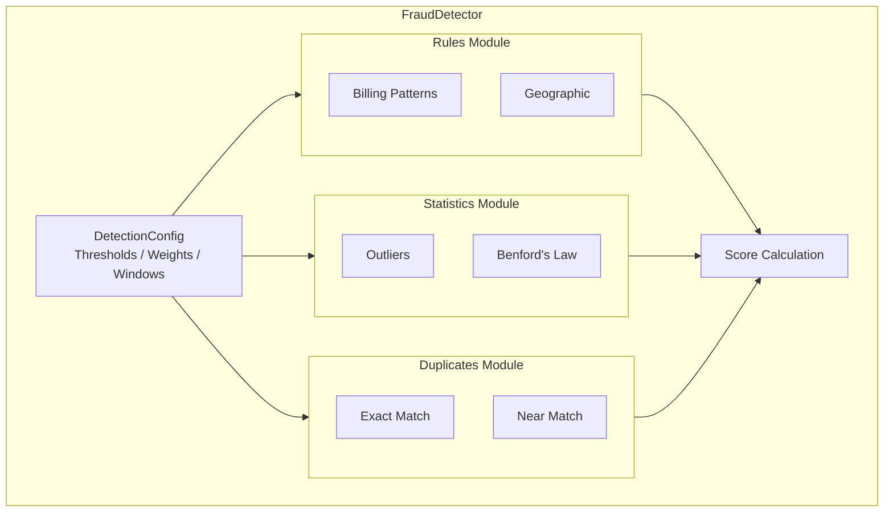
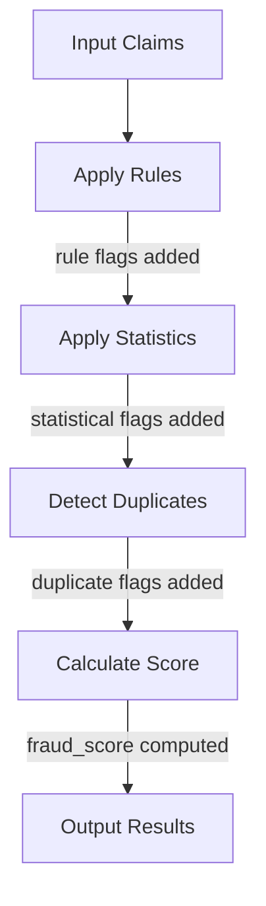

# System Design

## Overview

The Insurance Fraud Detection system is designed as a batch processing pipeline that analyzes insurance claims for potential fraud indicators.

## Design Principles

1. **Scalability**: Handle millions of claims using distributed processing
2. **Modularity**: Independent detection components that can be mixed and matched
3. **Explainability**: Clear reasoning for each fraud flag
4. **Configurability**: Adjustable thresholds without code changes
5. **Testability**: Each component independently testable

## Component Architecture



## Module Structure

### FraudDetector

The main orchestrator that coordinates all detection methods.

```python
class FraudDetector:
    def __init__(self, spark, config):
        self.billing_rules = BillingPatternRules(spark, config)
        self.duplicate_detector = DuplicateDetector(spark, config)
        self.geographic_rules = GeographicRules(spark, config)
        self.outlier_detector = OutlierDetector(spark, config)
        self.benfords_analyzer = BenfordsLawAnalyzer(spark)

    def detect(self, claims: DataFrame) -> DataFrame:
        claims = self._apply_rules(claims)
        claims = self._apply_statistics(claims)
        claims = self._detect_duplicates(claims)
        return self._calculate_fraud_score(claims)
```

### Detection Components

Each component is independent and stateless:

```python
# Rules module
class BillingPatternRules:
    def check_daily_procedure_limits(self, claims) -> DataFrame
    def check_patient_claim_frequency(self, claims) -> DataFrame
    def check_weekend_billing(self, claims) -> DataFrame
    def check_round_amounts(self, claims) -> DataFrame

class GeographicRules:
    def check_provider_patient_distance(self, claims) -> DataFrame
    def check_state_mismatch(self, claims) -> DataFrame

# Statistics module
class OutlierDetector:
    def detect_zscore_outliers(self, df, column, output) -> DataFrame
    def detect_iqr_outliers(self, df, column, output) -> DataFrame

class BenfordsLawAnalyzer:
    def analyze(self, df, column, group_by) -> DataFrame
    def get_distribution_report(self, df, column) -> DataFrame

# Duplicates module
class DuplicateDetector:
    def detect(self, claims) -> DataFrame
```

## Data Flow

### Input Schema

```
claims
├── claim_id: string (PK)
├── patient_id: string
├── provider_id: string
├── procedure_code: string
├── diagnosis_code: string
├── service_date: date
├── submitted_date: date
├── charge_amount: decimal(10,2)
├── paid_amount: decimal(10,2)
├── patient_state: string
├── provider_state: string
└── place_of_service: string
```

### Processing Pipeline



### Output Schema

```
flagged_claims
├── claim_id: string
├── patient_id: string
├── provider_id: string
├── charge_amount: decimal(10,2)
├── fraud_score: double
├── fraud_reasons: array<string>
├── rule_violations: array<string>
├── statistical_flags: array<string>
├── is_duplicate: boolean
├── duplicate_of: string
└── processed_at: timestamp
```

## Configuration Management

### DetectionConfig

Central configuration class:

```python
@dataclass
class DetectionConfig:
    # Outlier detection
    outlier_zscore_threshold: float = 3.0
    outlier_iqr_multiplier: float = 1.5

    # Duplicate detection
    duplicate_similarity_threshold: float = 0.9
    duplicate_time_window_days: int = 30

    # Geographic rules
    max_provider_patient_distance_miles: float = 500.0

    # Billing rules
    max_daily_procedures_per_provider: int = 50
    max_claims_per_patient_per_day: int = 5

    # Scoring weights
    weight_rule_violation: float = 0.3
    weight_statistical_anomaly: float = 0.25
    weight_duplicate: float = 0.45
```

### Configuration Sources

1. **Defaults**: Hardcoded sensible defaults
2. **Code**: Override in Python
3. **CLI**: Command-line arguments
4. **Environment**: Environment variables
5. **File**: YAML/JSON configuration files

## Error Handling

### Graceful Degradation

Components handle missing data gracefully:

```python
def check_state_mismatch(self, claims):
    # Handle missing columns
    if "patient_state" not in claims.columns:
        return claims.withColumn("state_mismatch", F.lit(False))

    # Handle null values
    return claims.withColumn(
        "state_mismatch",
        F.when(
            F.col("patient_state").isNull() |
            F.col("provider_state").isNull(),
            F.lit(False)
        ).otherwise(...)
    )
```

### Validation

Input validation before processing:

```python
def detect(self, claims: DataFrame) -> DataFrame:
    self._validate_input(claims)
    # ...

def _validate_input(self, claims: DataFrame):
    required = ["claim_id", "patient_id", "provider_id"]
    missing = [c for c in required if c not in claims.columns]
    if missing:
        raise ValueError(f"Missing required columns: {missing}")
```

## Extension Points

### Custom Rules

```python
class CustomRules(BillingPatternRules):
    def check_custom_pattern(self, claims):
        # Implementation
        pass
```

### Custom Scoring

```python
class CustomScorer:
    def calculate_score(self, claims):
        # Custom scoring logic
        pass
```

### Plugin Architecture

Future enhancement: Dynamic plugin loading:

```python
# plugins/my_detector.py
class MyDetector:
    def detect(self, claims):
        pass

# config.yaml
plugins:
  - plugins.my_detector.MyDetector
```
