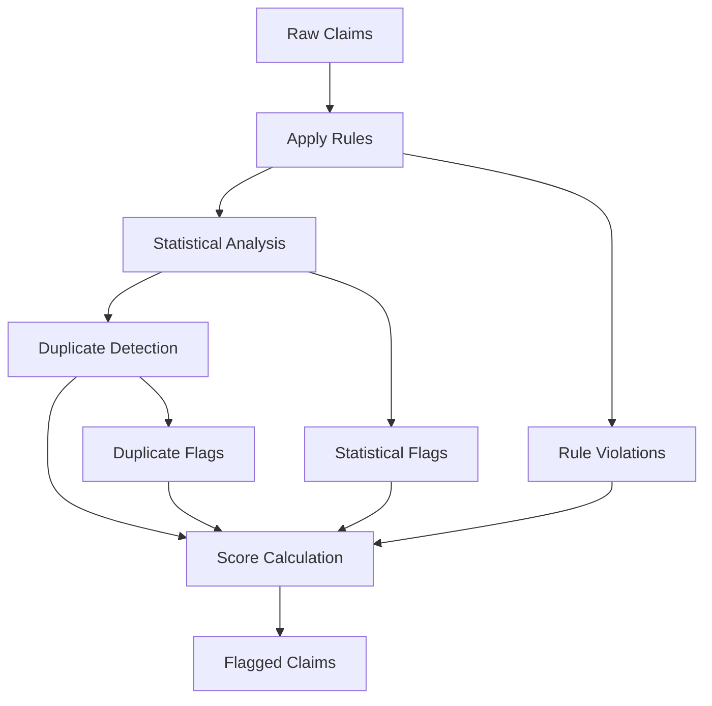

# Overview

The Insurance Fraud Detection system uses a multi-layered approach to identify potentially fraudulent claims.

## Detection Philosophy

Healthcare fraud detection requires balancing:

1. **Precision**: Minimizing false positives that waste investigator time
2. **Recall**: Catching as much actual fraud as possible
3. **Explainability**: Providing clear reasons for each flag

Our approach combines multiple detection methods, each contributing to a composite fraud score.

## Detection Methods

### 1. Rule-Based Detection

Explicit business rules based on domain knowledge:

- **Billing patterns**: Daily procedure limits, claim frequency
- **Geographic rules**: Provider-patient distance, state mismatches
- **Temporal patterns**: Weekend billing, suspicious timing
- **Amount patterns**: Round numbers, unusual charge ratios

**Strengths**: Interpretable, no training data required, domain expert input

**Weaknesses**: Can be circumvented, may miss novel fraud patterns

### 2. Statistical Detection

Data-driven anomaly detection:

- **Z-score outliers**: Values far from the mean
- **IQR outliers**: Values outside the interquartile range
- **Benford's Law**: First-digit distribution analysis

**Strengths**: Catches unusual patterns without explicit rules

**Weaknesses**: Requires sufficient data, may flag legitimate outliers

### 3. Duplicate Detection

Identifies claim resubmissions:

- **Exact duplicates**: Identical key fields
- **Near-duplicates**: High similarity with minor changes

**Strengths**: High precision for a common fraud type

**Weaknesses**: Sophisticated fraud may evade detection

## Fraud Score Calculation

Each claim receives a composite fraud score (0-1):

```
fraud_score = (rule_score * 0.30) +
              (statistical_score * 0.25) +
              (duplicate_score * 0.45)
```

Where:

- `rule_score`: Fraction of rule violations (0-1)
- `statistical_score`: Fraction of statistical flags (0-1)
- `duplicate_score`: 1.0 if duplicate, 0.0 otherwise

These weights are somewhat arbitrary

## Risk Categories

Based on fraud score, claims are categorized:

| Category | Score Range | Recommended Action |
|----------|-------------|-------------------|
| High Risk | > 0.7 | Immediate investigation |
| Medium Risk | 0.3 - 0.7 | Queued for review |
| Low Risk | ≤ 0.3 | Standard processing |

## Output Schema

The detection output includes:

| Field | Type | Description |
|-------|------|-------------|
| `claim_id` | string | Original claim identifier |
| `fraud_score` | double | Composite score (0-1) |
| `fraud_reasons` | array | All triggered flags |
| `rule_violations` | array | Rule-based flags |
| `statistical_flags` | array | Statistical flags |
| `is_duplicate` | boolean | Duplicate detection result |
| `duplicate_of` | string | Reference claim ID if duplicate |
| `processed_at` | timestamp | Processing timestamp |

## Data Flow



## Extensibility

The system is designed for extension:

- Add custom rules by extending `BillingPatternRules`
- Implement new statistical methods in `statistics/`
- Adjust scoring weights via `DetectionConfig`

See [Development Guide](../development/contributing.md) for details.


## ML Integration
Most of the weights and thresholds are somewhat arbitrary and can be optimized using machine learning techniques. For instance, the rule-based detection can be enhanced by training a model to predict fraud based on historical data. Similarly, the statistical detection methods can be refined to better capture fraudulent patterns.

This is just for demonstration purposes, and the actual implementation would involve more detailed steps and considerations.
