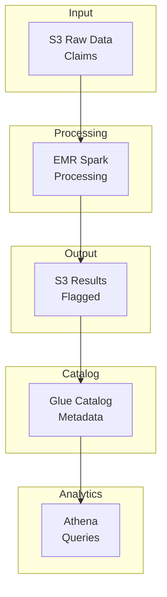

# Insurance Fraud Detection

A PySpark-based fraud detection system for insurance claims, deployed on AWS using CDK.

## Overview

This project demonstrates modern data engineering practices for detecting fraudulent insurance claims at scale:

- **Batch processing** of insurance claims using PySpark
- **Rule-based anomaly detection** for flagging unusual billing patterns
- **Statistical outlier detection** for identifying suspicious charges
- **Duplicate claim detection** using similarity matching
- **AWS-native deployment** using CDK infrastructure as code

## Features

### Rule-Based Detection

Identify fraud through configurable business rules:

- Provider billing pattern analysis
- Procedure code validation
- Geographic anomaly detection (state mismatches, impossible travel)
- Temporal pattern analysis (weekend billing, claim frequency)
- Round amount detection

### Statistical Detection

Apply statistical methods to find anomalies:

- Z-score outlier detection
- Interquartile Range (IQR) analysis
- Benford's Law analysis for charge amounts
- Provider-level billing deviation analysis

### Duplicate Detection

Find duplicate and near-duplicate claims:

- Exact match detection on key fields
- Fuzzy matching for near-duplicates
- Configurable similarity thresholds
- Time-window based detection

## Quick Start

```bash
# Install all dependencies (Python + Node.js + pre-commit hooks)
make install

# Generate sample data
make sample-data

# Run fraud detection locally
make run-local

# Analyze results
make analyze
```

## Architecture



## Project Structure

```
insurance-fraud/
├── packages/
│   ├── fraud_detection/     # PySpark fraud detection application
│   ├── infra/               # AWS CDK infrastructure
│   └── docs/                # This documentation site
├── pyproject.toml           # Root project configuration
└── README.md
```

## Data Sources

This project is designed to work with:

- [CMS Medicare Provider Utilization and Payment Data](https://data.cms.gov/)
- Synthetic claims data for development and testing

## License

MIT
